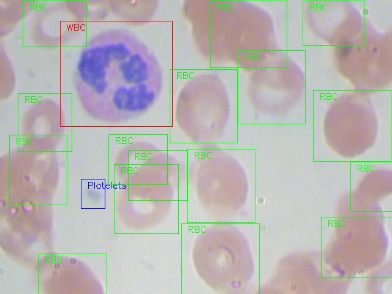

# BCCD Dataset

BCCD Dataset is a small-scale dataset for blood cells detection.

Thanks the original data and annotations from [cosmicad](https://github.com/cosmicad/dataset) and [akshaylamba](https://github.com/akshaylamba/all_CELL_data). The original dataset is re-organized into VOC format. BCCD Dataset is under *[MIT licence](./LICENSE)*.

#### Overview of dataset

* You can see a example of the labeled cell image.

  We have three kind of labels :

  * RBC (Red Blood Cell)
  * WBC (White Blood Cell)
  * Platelets (血小板)

  


* The structure of the `BC_dataset`

  ```
  ├── Annotations
  │   └── BloodImage_00XYZ.xml (364 items)
  ├── ImageSets
  │   └── Main
  │          ├── test.txt
  │          ├── train.txt
  │          ├── trainval.txt
  │          └── val.txt
  ├── JPEGImages
  │   └── BloodImage_00XYZ.jpg (364 items)
  ├── split.py         # A script to generate four .txt in ImageSets
  ├── visualize.py     # A script to generate labeled img like example.jpg
  ├── example.jpg      # A example labeled img generated by visualize.py
  ├── LICENSE
  └── README.md
  ```

* The  `JPEGImages`:

  * **Image Type** : *jpeg(JPEG)*
  * **Width** x **Height** : *640 x 480*

* The `Annotations` : The VOC format `.xml` for Object Detection, automatically generate by the label tools. Below is an example of `.xml` file.

  ```xml
  <annotation>
  	<folder>JPEGImages</folder>
  	<filename>BloodImage_00000.jpg</filename>
  	<path>/home/pi/detection_dataset/JPEGImages/BloodImage_00000.jpg</path>
  	<source>
  		<database>Unknown</database>
  	</source>
  	<size>
  		<width>640</width>
  		<height>480</height>
  		<depth>3</depth>
  	</size>
  	<segmented>0</segmented>
  	<object>
  		<name>WBC</name>
  		<pose>Unspecified</pose>
  		<truncated>0</truncated>
  		<difficult>0</difficult>
  		<bndbox>
  			<xmin>260</xmin>
  			<ymin>177</ymin>
  			<xmax>491</xmax>
  			<ymax>376</ymax>
  		</bndbox>
  	</object>
      ...
  	<object>
  		...
  	</object>
  </annotation>
  ```

